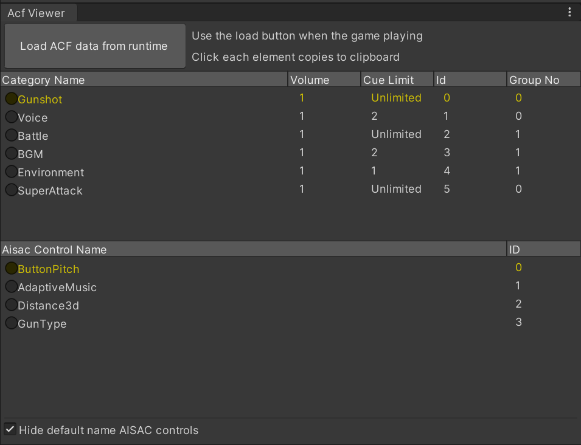

# ADX2 for Unity Acf Viewer
Unity + ADX2環境においてACFファイルの中身を表示するEditor拡張です。
カテゴリ名またはAISACコントロール名をクリックすると、クリップボードに名前がコピーされます。

## 使い方
パッケージをインポート後、メニューのWindow -> Open Acf Viewer Windowからこのウィンドウを開きます。

エディタで**ゲームを再生状態にしてから**「Load ACF data from runtime」ボタンをクリックしてacfの内容を読み込みます。

## 機能

### カテゴリ一覧
このプロジェクトで設定されているカテゴリの情報を表示します。
カテゴリ名、カテゴリボリューム、キューリミット（再生上限数）、カテゴリID、カテゴリグループ番号が取得できます。

各項目名をクリックすると昇順にソートされます。

カテゴリ名をクリックするとクリップボードにその内容がコピーされます。

### AISACコントロール一覧
このプロジェクトで設定されているAisac Control名の一覧を表示します。
名前とIDが取得できます。

各項目名をクリックすると昇順にソートされます。

AISACコントロール名をクリックするとクリップボードにその内容がコピーされます。

### Hide default name AISAC controlsオプション
このオプションをオフにすると、デフォルトのAISAC名(AisacControl_01など)も表示します。

### ScriptableObjectとしてのデータ保存
各データはScriptable Objectとして保存されます。
Editorフォルダ外にコピーすればゲーム実行中でも使用できます。

## 確認環境
* Unity 2019.4.1f1
* ADX2 LE SDK 2.10.05
